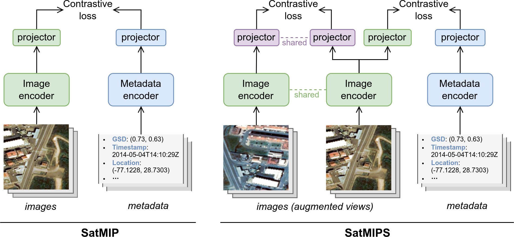

# Satellite Metadata-Image Pretraining (SatMIP)

<picture>
  <source media="(prefers-color-scheme: dark)" srcset="./assets/satmip-satmips-dark.png">
  <source media="(prefers-color-scheme: light)" srcset="./assets/satmip-satmips-light.png">
  
</picture>

This repository hosts the PyTorch implementation of the paper *"Learning Representations of Satellite Images from Metadata Supervision"* presented at ECCV 2024.
[`Paper (HAL)`](https://hal.science/hal-04709749); [`Paper (ECVA)`](https://www.ecva.net/papers/eccv_2024/papers_ECCV/html/3849_ECCV_2024_paper.php); <!-- [`Paper (arXiv)`](https://arxiv.org/na); [`Paper (Springer)`](https://link.springer.com/chapter/10.1007/978-3-031-73383-3_4) -->
[`Poster`](./assets/satmip-poster-eccv24.pdf).

> [!IMPORTANT]
> Code and models will be uploaded shortly after ECCV'24. Stay tuned by watching our repo !

## Citation

```
@inproceedings{bourcier2024satmip,
  title={Learning Representations of Satellite Images From Metadata Supervision},
  author={Bourcier, Jules and Dashyan, Gohar and Alahari, Karteek and Chanussot, Jocelyn},
  booktitle={European Conference on Computer Vision (ECCV)},
  year={2024}
}
```
